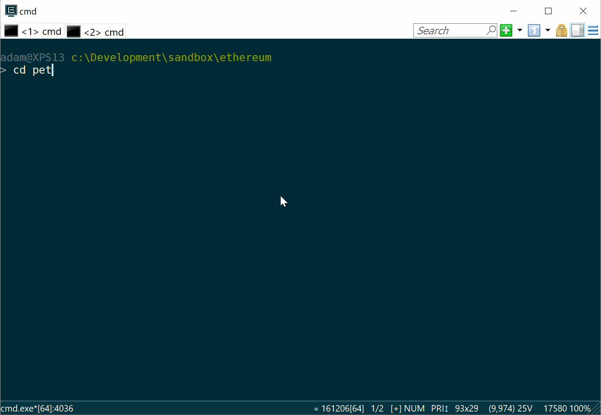

Repl Alliance
-------------

A repl for exploring ethereum contracts
deployed with truffle.

### Installation

It's not current deployed to npm, so we're still installing like so

```bash
npm install -g BinaryCannon/repl-alliance
```

Once it's installed you can run it inside a truffle project

```bash
repl-alliance
```

All options:

```bash
repl-alliance [<truffle dir>] [--dir <truffle dir>] [--environment <env>] [--script <script file>]
```
By default, the truffle dir is set to `.` and the enironment is set to `development`.

### In Use




### Built in commands

* `use` selects a smart contract.  Hit tab to see a list of the contracts you can choose from.
* `run` runs a script.
* `become` selects a user to become. You can use an account number or a username from the address book.
* `addressBook` displays the address book or lets you add a new user to it.
* `help` displays the help for a command, including the arguments.

When you run the repl against a truffle project, it reads the networks out of
`truffle-config.json`, and the contract definitions out of `build/contracts`.

After you `use` a contract, each function it defines is now available as a command in the 
repl.  There is tab autocompletion for contracts and addresses to make it easier to
explore.